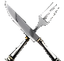

# </img> HealerMana
A customizable addon for World of Warcraft: Midnight to keep track of the healer's mana inside the group with class specialization icon and name display. The initial goal is to make the addon resemble the old healer mana WeakAura that has been truncated by Blizzard with the recent addon sweep fiasco.

<h3>Project structure</h3>

```text
HealerMana
├─ assets/                      -- Folder for static resources
   └─ logo.png                  -- Branding
   └─ sounds/                   -- Folder for sound alerts
      └─ healerDrinking.mp3
      └─ healerLowMana.mp3
├─ HealerMana.toc               -- General metadata and file loading order
└─ HealerMana.lua               -- Core addon algorithms
```

<h3>Legal</h3>
The addon is provided free of charge and is intended for personal use within World of Warcraft. It does not include any paid features, advertisements, or monetization.

<h3>Contributing</h3>
If you would like to contribute, feel free to open an issue to report bugs, suggest improvements, or discuss new features.<br>

Pull requests are also welcome for fixes, optimizations, or additional functionality.
