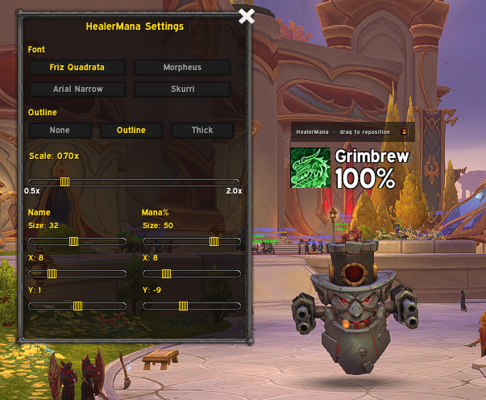
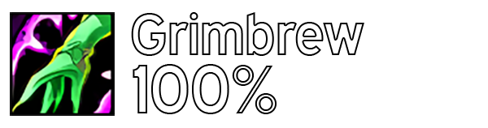
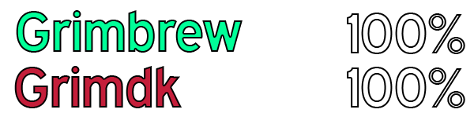

# HealerMana 
A customizable addon for World of Warcraft: Midnight to keep track of the healer's mana (with a percentage indicator) inside the group with class specialization icon and name display. The initial goal is to make the addon resemble the old healer mana WeakAura that has been truncated by Blizzard with the recent addon sweep fiasco.

<details>
  <summary><b>Showcase</b> - Current and planned features for the future.</summary>
  <br>
  <div align="center">
    </img><br>

  | Planned default party design | Planned default raid design |
  |------|------|
  | <div align="left">- The icon will change if the healer is currently restoring mana or not. <br> - The NUM% part will change color based on the percentage.</div>    | <div align="left">- The NUM% part will change color based on the percentage.</div>    |
  | </img>    | </img>    |
    
  </div>
</details>

<h3>Project structure</h3>

```text
HealerMana
├─ assets/                      -- Static resources
│  ├─ logo.png                  -- Branding
│  └─ sounds/                   -- Sound alert files
│     ├─ healerDrinking.mp3
│     └─ healerLowMana.mp3
├─ healermana.toc               -- Addon metadata and file load order
├─ healermana.lua               -- Core logic (healer tracking, frames, events)
└─ settings.lua                 -- In-game settings panel UI (/hms)
```

<h3>Commands</h3>

| Command | Description |
|---------|-------------|
| `/hm` | Toggle **edit mode**. Shows a drag handle above the healer frames so you can reposition the display anywhere on screen. Click the lock icon on the handle to save the position and exit edit mode. |
| `/hms` | Toggle the **settings panel**. Lets you change the font, outline style, and display scale. Changes apply instantly and persist across sessions. |
| `/hmtest` | Populate a **test frame** using your own character, useful for previewing the display when you are not in a dungeon group. |

<h3>Legal</h3>
The addon is provided free of charge and is intended for personal use within World of Warcraft. It does not include any paid features, advertisements, or monetization.

<h3>Contributing</h3>
If you would like to contribute, feel free to open an issue to report bugs, suggest improvements, or discuss new features.<br>

Pull requests are also welcome for fixes, optimizations, or additional functionality.
